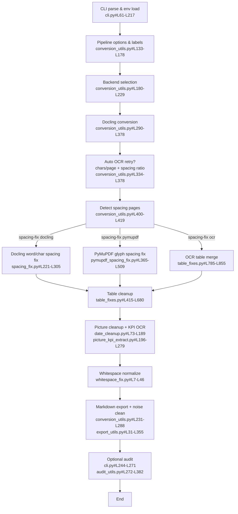
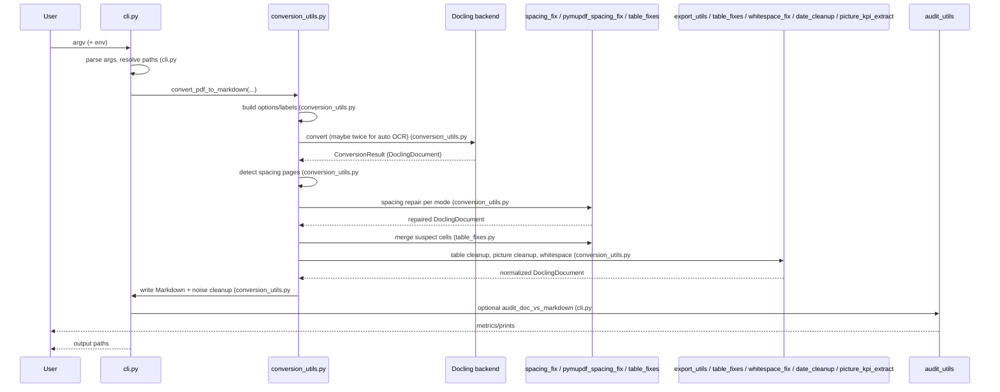

# Diagrams

## Flowchart


## Sequence


## Components
```mermaid
graph LR
    CLI[CLI (cli.py)] --> Conv[conversion_utils.py]
    Conv --> Docling[Docling backends\n(pypdfium2 / docling-parse-v4)]
    Conv --> Spacing[Spacing fixes\nspacing_fix.py / pymupdf_spacing_fix.py]
    Conv --> Tables[Table repairs\ntable_fixes.py]
    Conv --> Pictures[Picture/KPI cleanup\ndate_cleanup.py / picture_kpi_extract.py]
    Conv --> TextNorm[Whitespace & encoding\nwhitespace_fix.py / text_normalize.py]
    Conv --> Export[Markdown export\nexport_utils.py]
    Conv --> AuditUtil[Audit utilities\naudit_utils.py]
    CLI --> Scripts[Scripts\naudit_pdf_vs_md.py / quality_report.py]
    Export --> Output[Markdown + images]
    AuditUtil --> AuditOut[Audit metrics]
    Scripts --> AuditUtil
    Scripts --> Conv
```

Nodes correspond to the stages named in [docs/PIPELINE_OVERVIEW.md](PIPELINE_OVERVIEW.md).
